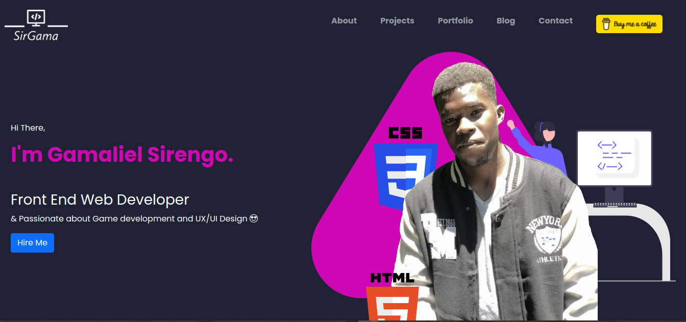

# PERSONAL PORTFOLIO

 

## Table of Contents

- [PERSONAL PORTFOLIO](#personal-portfolio)
  - [Table of Contents](#table-of-contents)
  - [Description](#description)
  - [Installation](#installation)
    - [SITE LINK - GH-PAGES](#site-link---gh-pages)
    - [Technologies Used](#technologies-used)
  - [License](#license)
  - [Author Info](#author-info)

## Description

This is a personal portfolio website showcasing who I am, Projects I've done and services I offer.

## Installation

If you want to clone this repository to your local machine, use the following command: 

<code> git clone https://github.com/sirgama/Portfolio-v1.0.git</code>

 The command <code>git clone </code> is dependent on git.  
 To install git in your pc, run: 
<code>sudo apt update && sudo apt upgrade</code> 
<code>sudo apt install git</code>

### SITE LINK - GH-PAGES
The Portfolio is being hosted by Github Pages. The link to the page is:

<a href="https://sirgama.github.io/Portfolio-v1.0/">https://sirgama.github.io/Portfolio-v1.0/</a>

### Technologies Used
* HTML - which was used to build the structure of the pages.

* CSS - which was used to custom style different sections of the portfolio.

* BOOTSTRAP - used for styling as well as making the website responsive.
  
* FIGMA - Used for the main picture at the hero section with vector arts

## License

MIT License

Copyright (c) [2022] [Gamaliel Sirengo]. All Rights Reserved.
<a href="./LICENSE"> LICENSE</a>

## Author Info

Gamaliel Sirengo 
https://github.com/sirgama
 